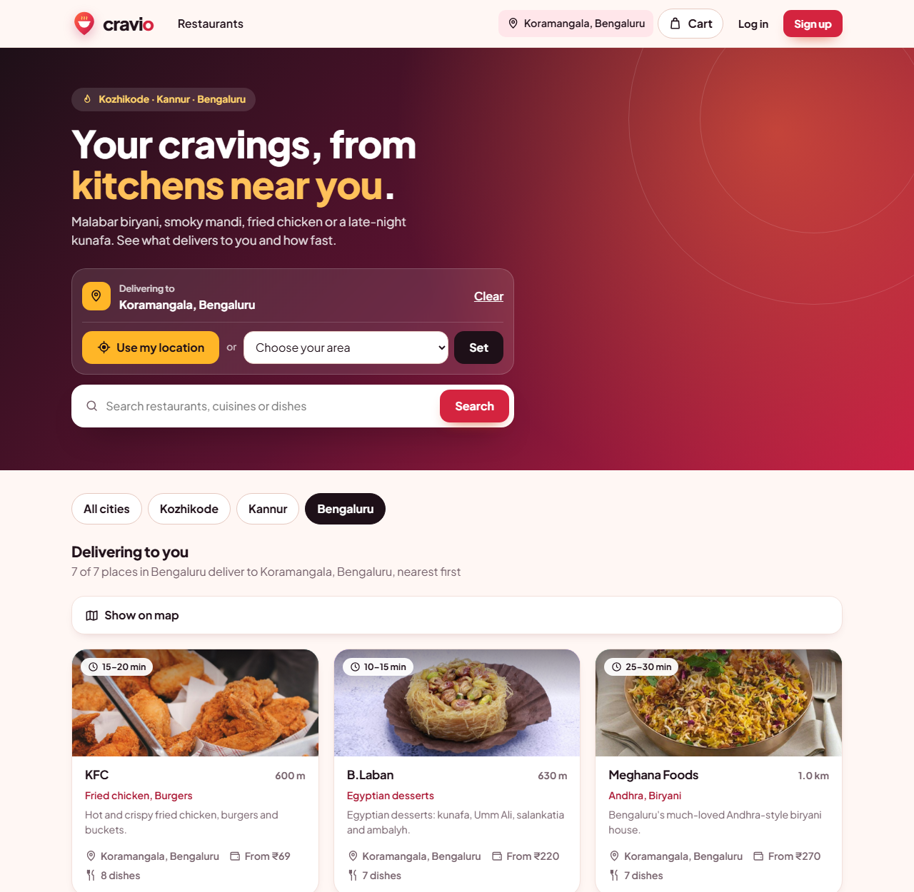
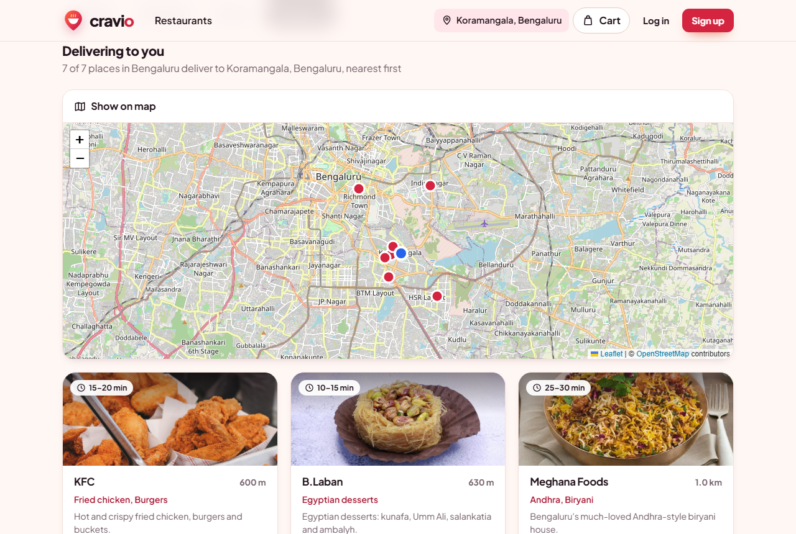
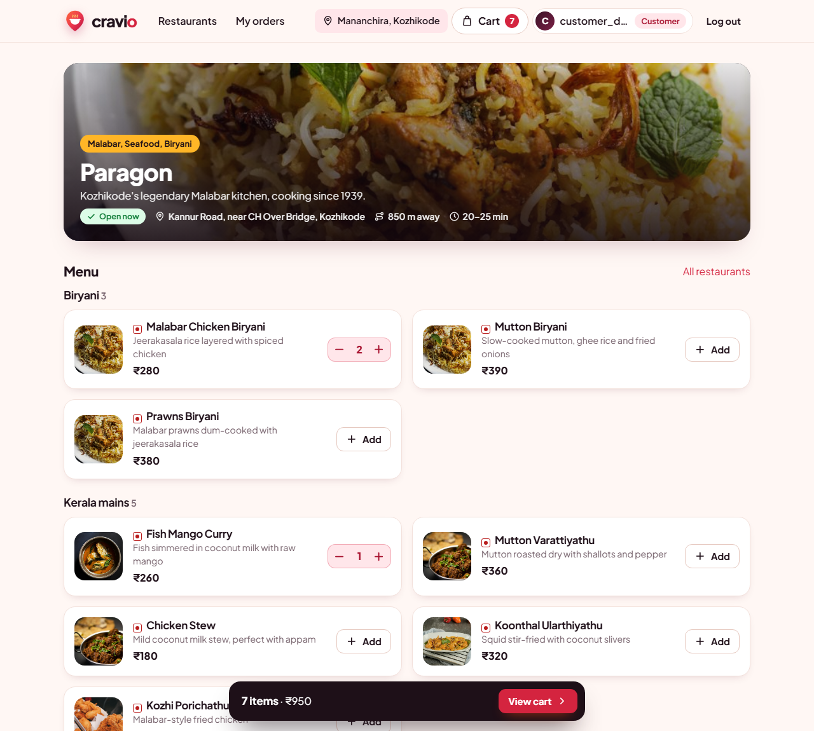
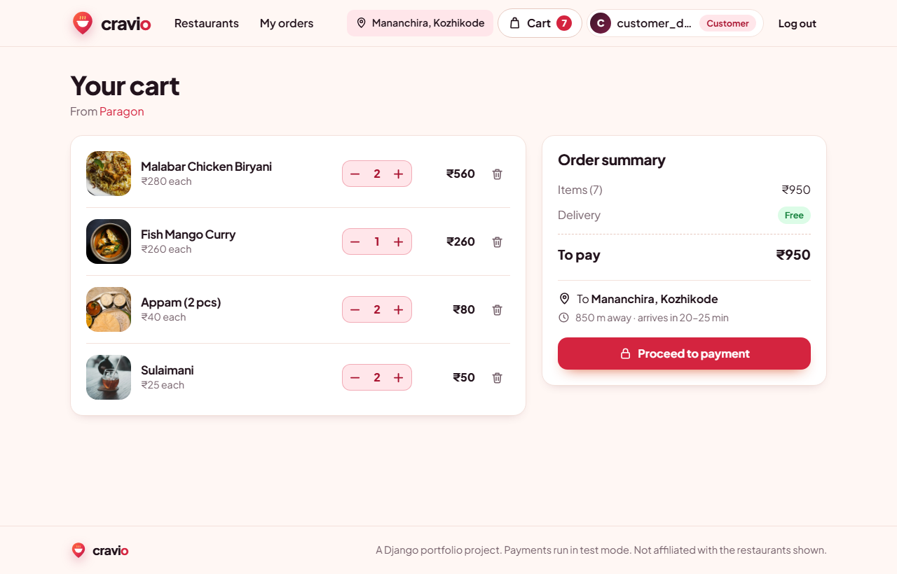
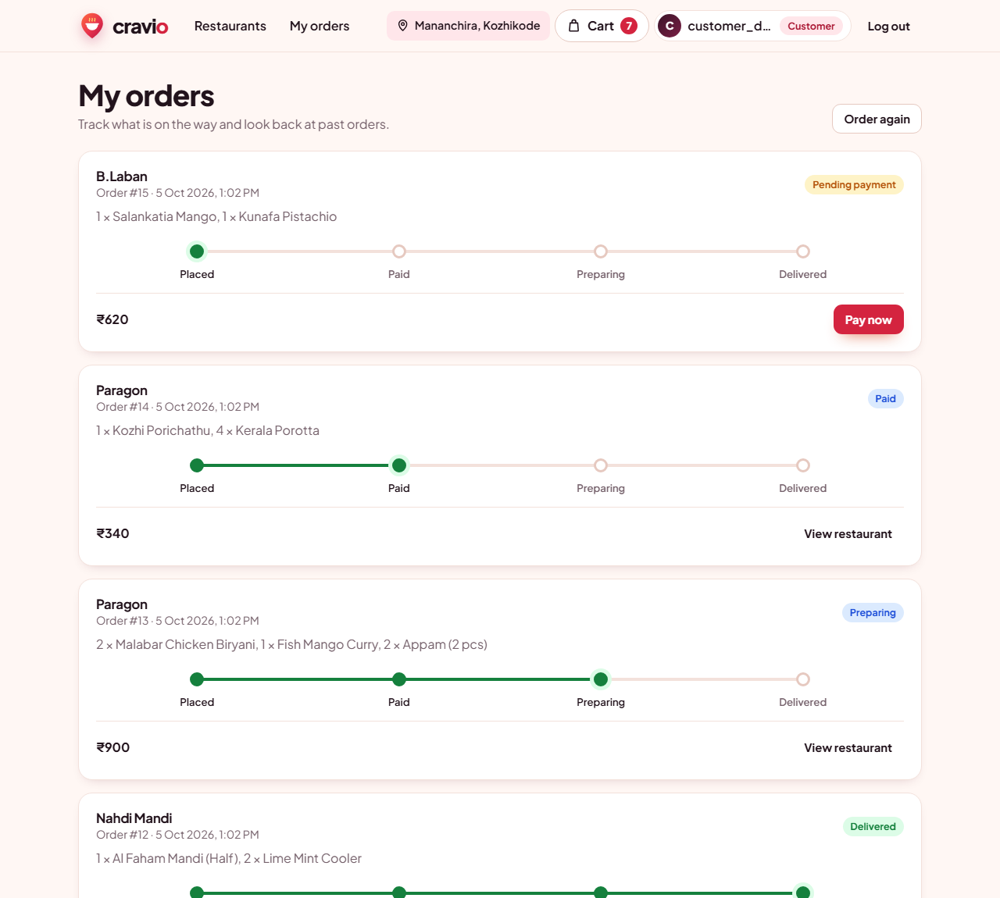
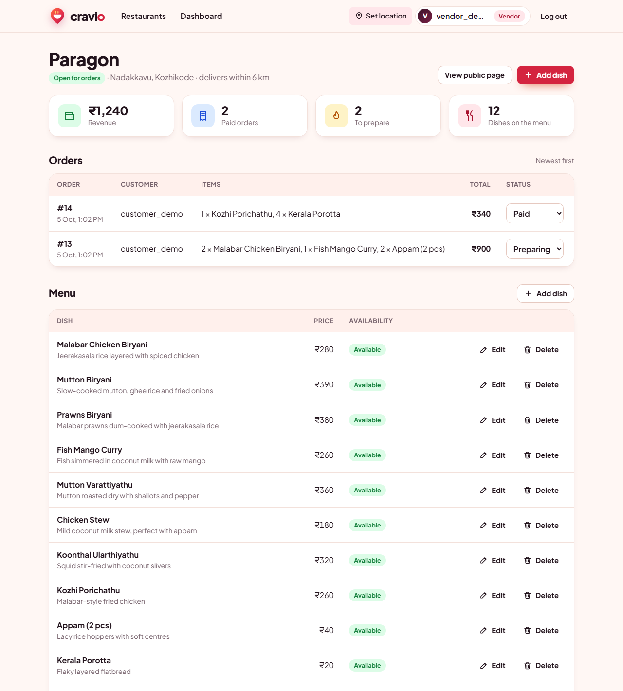
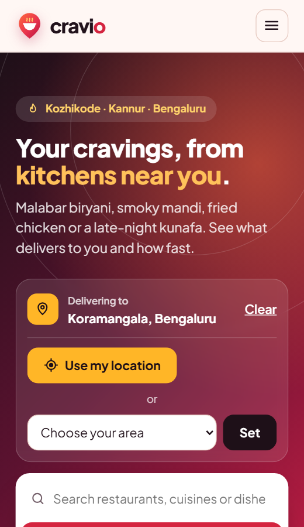
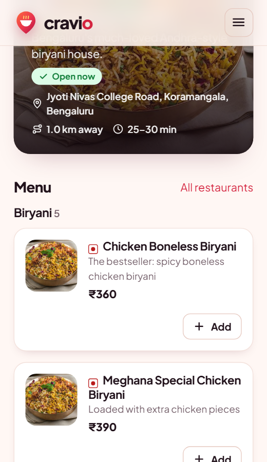

# Cravio - Food Delivery, Nearby


A full-stack food delivery platform built with **Django** and **MySQL**. Customers set their location and
see the restaurants that can deliver to them, sorted by distance with a delivery-time estimate. Vendors run
their menu and orders, and admins see the whole platform. Role-based access control throughout,
**Razorpay** checkout, an **OpenStreetMap** restaurant map, and a hand-built responsive design with no CSS
framework.

**[▶ Live demo](https://cravio-p4lw.onrender.com)** (deployed on Render from [`render.yaml`](render.yaml)). The free
server sleeps when idle, so the first visit takes about 30 seconds. To try Ask Cravio there, paste **your own
Claude API key** in the chat panel: it stays in your browser tab, is sent only with your messages and is
never stored on the server.

**Ask Cravio** is a built-in AI ordering assistant powered by the **Claude API with tool use**: tell it
"biryani under ₹300 that reaches me in 30 minutes" and it searches the real menus, checks delivery range,
and adds dishes to your cart, while checkout always stays with the customer.

The demo data covers 15 real restaurant outlets in **Kozhikode, Kannur and Bengaluru**, including Paragon,
Rahmath Hotel, Nahdi Mandi, KFC, Domino's, Pizza Hut, B.Laban, Odhen's and Meghana Foods.

| Home: nearest first, with delivery times | Map of restaurants near you |
|---|---|
|  |  |

| Menu with photos and live cart | Cart with delivery distance and time |
|---|---|
|  |  |

| Order tracking | Vendor dashboard |
|---|---|
|  |  |

| Phone: home | Phone: menu |
|---|---|
|  |  |

## Features
**Location and delivery**
- **Use my location:** the browser's geolocation finds the customer, and the nearest area names it
  ("Near Koramangala, Bengaluru"). Without location access, or without JavaScript, they pick an area instead
- Restaurants are **sorted by distance**, each with the distance and a **delivery-time window**
  (kitchen time plus travel time, for example "25-30 min")
- **Delivery radius:** every outlet delivers within its own radius (5-7 km). Outlets that are too far are
  greyed out and marked "Out of delivery range", and the server refuses to add their dishes to the cart or
  check out, even if the request is sent by hand
- **City tabs** for Kozhikode, Kannur and Bengaluru, and a message for locations outside the service area
- **Map view:** an interactive OpenStreetMap map (Leaflet, no API key) with every restaurant and the customer

**Ask Cravio, the AI ordering assistant**
- A chat panel on every customer page, powered by Claude (`claude-opus-5-5`) through the Anthropic Python SDK
- **Tool use (an AI agent):** Claude can call five server-side tools: list nearby restaurants, read a menu,
  search dishes (with price and veg filters), add to cart and view the cart. Each tool is plain Python over
  the same data and rules as the website, so the AI can never do anything a customer couldn't
- **Safe by design:** the API key stays on the server; the AI cannot check out, pay or see other customers'
  data; dishes it adds go through the same delivery-range check as the Add button
- **Grounded answers:** the system prompt only allows dishes and prices that a tool returned
- **Cost and abuse limits:** 500 characters per message, 6 model calls per message, 15 messages per chat,
  low reasoning effort for quick replies, and prompt caching for the tool definitions and history
- The conversation is kept in the session exactly as the API returned it (append-only), and survives moving
  between pages

**Customers**
- **Search** by restaurant, cuisine or dish
- Menus grouped into sections, with food photos and the Indian veg / non-veg mark on every dish
- Plus and minus quantity buttons and a cart bar that follows you down the page
- Session cart, checkout, and an **order history with a progress tracker** (placed, paid, preparing, delivered)

**Vendors**
- Set up a restaurant with its area, exact position, delivery radius and typical kitchen time
- Add, edit and delete dishes, with menu sections and a vegetarian flag
- Dashboard with revenue, paid orders, orders to prepare and menu size
- Move paid orders through preparing and delivered. An unpaid order can never be marked as paid by hand.

**Admins**
- Platform overview: revenue, orders, restaurants and users, plus the latest orders and the Django admin

**Under the hood**
- **Role-based access control:** a `role_required` decorator guards every dashboard (403 for the wrong role),
  each role lands on its own page after login, and vendors can only touch their own restaurant's data
- **Distance maths:** the haversine formula in `restaurants/location.py`; the customer's location is kept
  in the session only, never in the database or in URLs
- **Razorpay payments:** server-side order creation and signature verification. With no API keys it falls
  back to a clearly labelled simulated payment, so the whole flow can be demoed without real money
- Redirects after cart and location actions only go to pages on this site (no open redirects)
- 79 automated tests covering access control, distance and delivery-range rules, search, the cart,
  checkout, dashboards, the demo data, template filters and the AI assistant (its tools and agent loop are
  tested with a fake Claude client, so the tests need no API key and cost nothing)

## Design
- A new identity: the Cravio logo is a map pin holding a steaming bowl, in a raspberry-to-coral gradient
  with a saffron accent
- One stylesheet (`static/css/style.css`) built on CSS variables: cards, badges, forms, tables, toasts, a
  progress tracker and the location picker
- JavaScript only where it adds something: the location button, the map and the Razorpay checkout.
  The mobile menu and the auto-hiding messages are pure CSS
- Real food photos from Unsplash, credited in `static/img/food/CREDITS.md`; restaurants without a photo
  fall back to a generated cover with their initial
- Prices use Indian digit grouping through a small `inr` template filter (₹1,25,000)
- Responsive from phone to desktop, keyboard-friendly, and animations respect "reduce motion"

## Tech
Python, Django, MySQL (SQLite for quick local runs), Anthropic Claude API (tool use), Razorpay API,
Leaflet + OpenStreetMap, HTML, CSS, JavaScript

## Run locally
```bash
python -m venv .venv
.venv\Scripts\activate            # Windows (use source .venv/bin/activate on macOS/Linux)
pip install -r requirements.txt

python manage.py migrate
python manage.py seed_demo         # 15 restaurant outlets + demo users
python manage.py runserver
```
Open http://127.0.0.1:8000 and pick an area such as **Koramangala, Bengaluru** or **Mananchira, Kozhikode**.
Demo logins: `customer_demo`, `vendor_demo` (Paragon, Kozhikode) and `admin_demo`
(password is in `accounts/management/commands/seed_demo.py`; demo data only).

"Use my location" needs a secure page: it works on `localhost` and on any HTTPS site.

### Use MySQL
```bash
pip install mysqlclient
set DB_ENGINE=mysql
set DB_NAME=cravio
set DB_USER=root
set DB_PASSWORD=your-password
```

### Enable Ask Cravio (AI assistant)
Create an API key in the [Claude Console](https://platform.claude.com) and set it before starting the server:
```bash
set ANTHROPIC_API_KEY=your-key            # Windows (export ANTHROPIC_API_KEY=... on macOS/Linux)
```
Optional: `CRAVIO_AI_MODEL` (default `claude-opus-5-5`) and `CRAVIO_AI_EFFORT` (default `low`). Without a key the
rest of the site works normally and the chat panel explains that the assistant is not set up.

### Enable Razorpay (test mode)
Create test keys in the Razorpay dashboard and set `RAZORPAY_KEY_ID` and `RAZORPAY_KEY_SECRET`
(see `.env.example`). Use Razorpay's published test card numbers; never commit real keys.

## Tests
```bash
python manage.py test
```

## Project structure
```
accounts/      custom User model with roles, login/signup, RBAC decorator, admin dashboard, seed command
restaurants/   Restaurant + MenuItem models, location maths, search, map data, vendor dashboard, menu CRUD
orders/        session cart (and the shared add-to-cart rules), delivery-range checks, orders, Razorpay payments
assistant/     Ask Cravio: tools.py (what Claude may call), agent.py (the tool-use loop), chat endpoints
templates/     base layout, icon sprite and logo, location picker, shared form partial, one folder per app
static/        the stylesheet, scripts (location button, map, assistant chat), logo, favicon and food photos
```

## About the demo data
Cravio is a portfolio project. It is **not affiliated with, endorsed by or connected to** any of the
restaurants in the demo data. Their names and signature dishes are used only to make the demo realistic:
prices are approximate, outlet positions are close to the real ones, and no orders reach the restaurants.
Map data © [OpenStreetMap](https://www.openstreetmap.org/copyright) contributors.
